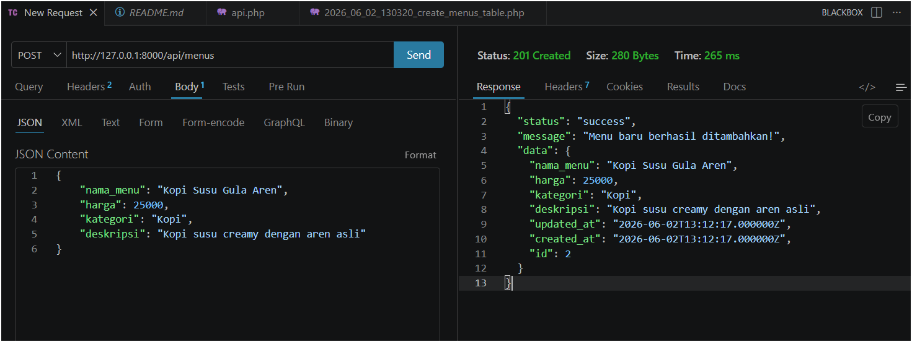
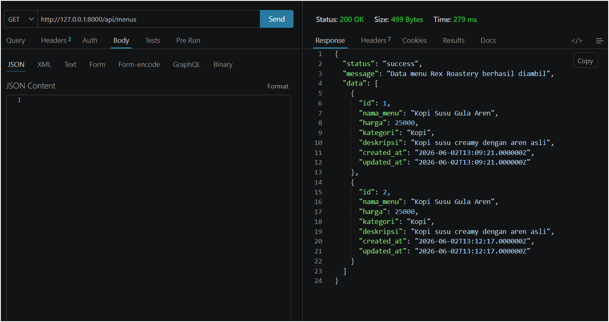

# UTS Pemrograman Web - API Rex Roastery

Aplikasi Backend berbasis Laravel 11 untuk mengelola data menu pada Cafe Rex Roastery.

## 👤 Identitas Developer
* **Nama:** David Prastiansyah
* **NIM:** 2305101026
* **Kelas:** 6B

## 🚀 Fitur Aplikasi
1. **Tambah Menu Baru (Create - POST):** Menginputkan data nama menu, harga, kategori, dan deskripsi ke database.
2. **Lihat Daftar Menu (Read - GET):** Menampilkan semua daftar menu yang tersedia dalam format JSON.

## 🛠️ Dokumentasi Pengujian API (Thunder Client)

### 1. Fitur Tambah Menu (POST)
Berhasil menambahkan data menu baru dengan respon status **201 Created**.

### 2. Fitur Lihat Menu (GET)
Berhasil mengambil semua data menu dari database dengan respon status **200 OK**.

